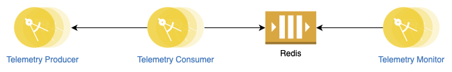
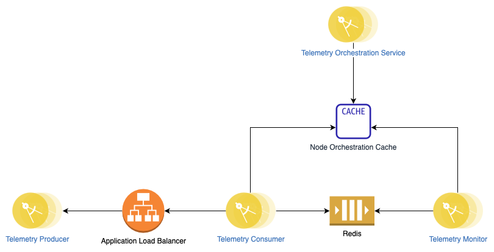

# CORE-Work-Trial


## Pre-Requisites

In order to run this app, you'll need both Docker, and Docker-Compose installed

## Instructions

To start the server, while in the `telemetry` directory, run 

```
make
```

That's it! This will spin up a mock distributed system with a Redis instance, a Producer instance, 3 Consumer instances, and 2 Monitor instances all communicating over a network bridge.

## Architecture



### Telemetry Producer

The `telemetry-producer` microservice is responsible for producing miner telemetry info. The actual implementation would involve talking to the individual miners to get their telemetry, but this service can't actually do that, so it causes random fluctiations in the "nominal" telemetry, and returns that. 

#### Endpoints 

```
GET /telemetry/:id 

id - string

Response: MinerTelemetry
```

### Telemetry Consumer

The `telemetry-consumer` microservice is responsible for consuming the miner telemetry info. Each instance of the service is responsible for a subset of all the miners and it polls the `telemetry-producer` microservice endpoint every 5 seconds to get the miner telemetry info. It then sends that info to a Redis stream for processing-- each miner has it's own dedicated stream based on ID. The reason for this is that the consumer of the stream can read from the streams it cares about rather than having to read through everything. 

Although I used Redis streams here, I think that using a more traditional message queue would be a more apt solution because once the messaage is consumed and handled, we no longer need it

### Telemetry Monitor

The `telemetry-monitor` microservice is responsible for consuming the miner telemtry info from the Redis stream. Similar to the `telemetry-consumer` microservice, it is responsible for a subset of all the miners. It works by polling the expected Redis streams for each of the miners it's responsible for and then checking if anything is wrong. If it determines something is wrong, it logs an error. 

At a high level, it looks at various metrics of the miner: hashrate, health, pool, sensor temperatures, and fan speeds. For the numeric fields like hashrate, fan speeds, and sensor temperatures, it looks for two things. One, is running average over the last X intervals significantly changed? Two, is the curernt value for those out of spec (as defined by the nominal values). For boolean values (health and pool), it just checks if the value is false (which is equivalent to down).

The current implementation logs the concerning telemetry out for a given miner, but an actual implementation could send these errors to another Redis stream (or message queue) for processing by some other service that knows "what to do", such as raising an alert. A simpler system could just set up alerts based on error logs.

## Docker

Luckily, with how NestJS defines their `npm` scripts, we can start individual apps by just passing in the app name into them-- because the code is shared, that means they can share a Dockerfile. This also means the `docker-compose.yaml` file is easy to define. 

The included `docker-compose.yaml` file is intended not to work as a production implementation but to work as a mock of a local distributed setup.

The included `Makefile` was added for ease of use to bring down the previous instance if it's still running, build the containers, and the spin them up. 

### Proposed Architecture


